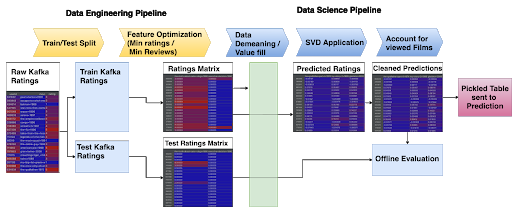

# SEAI Group 3 - Movie Recommendations Project

## This readme is converted from final presentation for CMU's master course Machine Learning in Production

The premise of the course was to implement, evaluate, operate, monitor, and evolve a recommendation service for a scenario of a movie streaming service. You work with a scenario of a streaming service with about 1 million customers and 27k movies (for comparison, Netflix has about 180 million subscribers and over 300 million estimated users worldwide and about 4000 movies or 13k titles worldwide). The course provided an event stream (Apache Kafka) of a streaming service site that records server logs, which include information about which user watched which video and ratings about those movies.

Our project focused on four areas of operating an ML pipeline in prodution, including deployment, scaling, reliability, drift and feedback loops.

Our team scored first overall with the best average user rating of reccomended films and most reccomended films watched to completion.

## Machine Learning portion - Learning to Make Recommendations

### Design Descision: Model Selections

Our primary design decision was selecting the type of model for our recommender system.
We considered three models before ultimately going with user-based collaborative filtering.

Our first consideration was Content based filtering.
we opted against this in the end because we felt we didn’t have the resources necessary to generate adequate movie features for an effective model.

We also considered item based collaborative filtering because of its advantages for sparse data.
However our research found within the film genre in specific item based filtering can suffer from overly obvious predictions and over specification.

In the end we opted for a User Based Collaborative Filter.
As we already had several hundred megabytes of kafka ratings we avoided the typical cold start problem
and because of the self calculating latent features, our SVD implementation offered the best balance of performance and set up time.

### Machine Learning Pipeline

Our ML pipeline was based on the kedro framework of nested pipelines.

For the data engineering portion we take in the raw ratings from the kafka stream
We perform a 90/10 train test split on the last 5 million ratings. We cap it at 5 million ratings to ensure memory consistency with a growing stream.

For our Feature optimization we transform the stream into a user-film matrix. We clean the data based on thresholds for number of ratings needed for a given user or movie to be considered.
We did this as films in the long tail of the distribution are unlikely to be recommended and hence not worth their computational cost and similarly users without a developed profile would be unlikely to receive useful recommendations.

Heading into the data science pipeline we pass that ratings matrix through demeaning and value fill transformations. The demeaning is necessary to account for tendency bias in how individual users rate
The value fill for unwatched movies was a also a tricky portion of the pipeline in that an unwatched film could indicate unintentional or intentional avoidance.

We then take that demeaned, filled a matrix, and ran it through our svd application generating a table of predicted ratings for all film user combinations. Next we retroactively go through this table and give already viewed films neutral ratings such that they are only ever recommended again when all other films have an adverse prediction for that user.

This table is then pickled and sent to the prediction app that will select the highest 20 rated films for a particular user as well as that table is used for offline evaluations.

### Offline Evaluation

Our deployed pipeline only withholds 10% of ratings for testing. This number is quite low because Matrix factorization is more adversely affected by withheld values than most ML models. Because of limitations in testing data we looked to use offline evaluation as a high level overview of model performance that would be supplemented with more detailed online metrics

In particular we looked to track general characteristics of the model such as the coverage of our movie catalog as well as basic statistics such as RMSE and Mean average error. These would give us general indications of which way the models performance was trending as well as a pre deployment indicator of critical errors which is what we deamed the primary purpose of offline evaluation.

## Provenance and Quality

### Provenance

For the sake of CI/CD we used Jenkins to creates/pushes a commit when model/data/pipeline is changed (i.e. upon a new build) This brought up the issue of how to tie a given reccomendation to a particular system state. Storing every version of a 30-50Mb model, plus input data will be extraordinarily expensive over time as well as any sort of Jenkins pushing commit would trigger Jenkins job again (circular); introducing a delay. The solution to this was we used Git+ DVC

### Code and Infrastrcutre Quality

Automated tests ensure the data being produced at each step meets the specifications later steps depend upon (cohesion thru pipeline).

Manual tests focused on failure states -- e.g. are production containers ok? Did we lose data?

Time limited, so focused on low complexity, high impact unit tests for data collection, feature engineering, and service response(pytest).

### Data Quality

We divided data quality tests in three levels.

Level 1: Ignore noisy data from the Kafka Stream via Regular expression check to avoid processing such events.

Level 2: Avoid missing and duplicate values in the dataset. Checks present in the ML pipeline's data engineering step.

Level 3: Validate dataset against the expected data type and format. Schema defined and validated against schema using Data Linter.

## Canary Release

### Telemetry: Initial Design (Single Model)

Metric: Average rating given by users to movies recommended by our prediction service. Why?

* Just checking whether the user has watched a movie we reccomended is not enough.
* How well was the recommended movie liked by the user?
* Something simoke enough to calculate

### Telemetry: Canary Deployment

We pivoted this system to allow us to implement canary releases. As seen below we utilized a dual docker container system with a load balancer to implement this.

### CI/CD Pipelines

We utilized 2 jenkins pipelines to manage both our ML and Telemetry. Our load balancer and Database containers were not part of the CD pipeline, being deployed manually instead as the load balancer and database are required to live past any given deployment.

### Canary Release: Infrastructre

## Monitoring

A list of things we wanted to monitor

* Health of deployment infrastructure
    * CPU / Memory / Disk usage
    * Container resource consumption telemtry

* Health of recommendation service
    * Succes rate of API response
    * Performance metrics

* Evaluate user rating behaviour
    * How are users rating movies normally?
    * How are users rating movies that were recommended?
        * Base model
        * Canary model

### Monitoring - Design

### Measures - Recommendation Service

* Time spent by processes
* Transaction Duration
* Requests per minute
* success Rate of API Endpoints (availability)

### Measures - Model Performance

* Overall average movie rating
* Average Movie rating on -
    * Base Model Recommendations
    * Canary Model Recommendations

## Reflection

Managing VM resources with respect to our deployment model was tricky. We had to adapt our work based on the resources we had (it was too late to switch to AWS towards the end)We dropped some training data, used a cloud-based trial version of monitoring stack, optimized model training, etc.

Choosing effective task intervals/schedules was difficult How often do we update the training data, create a new model, recalculate online metrics, etc.

The appropriate time the canary release should run was based on trial and error. How long should we wait till the Kafka stream would reflect changes in user behavior based on a recommendation? The results are flaky as we don’t always get the data we need within the 5 minute period we’ve set

If we had more time, We’d optimize our telemetry design, and make it more performant. Use a statistical significance test to decide whether to rollout/abort the canary release. Invest more in testing our code and infrastructure

If we had to do something different, Version the Jenkins pipeline, ie. have a JenkinsFile in GitHub to track changes and avoid conflicts/overwrites. Forecast future load and project milestones to decide which environment will better suit us. Load balancer is a bottleneck in our current design; add redundancy to promote availability
